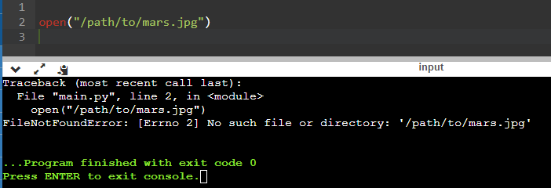
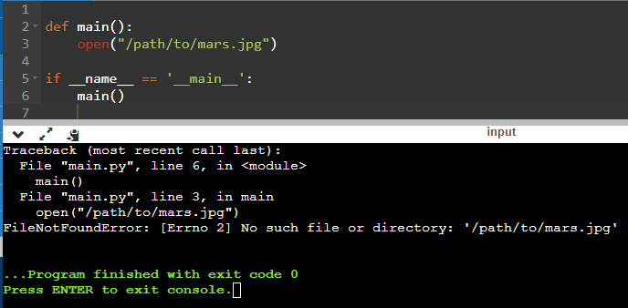
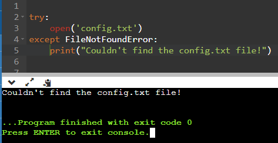
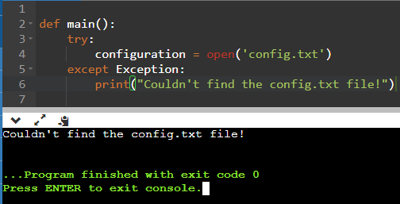
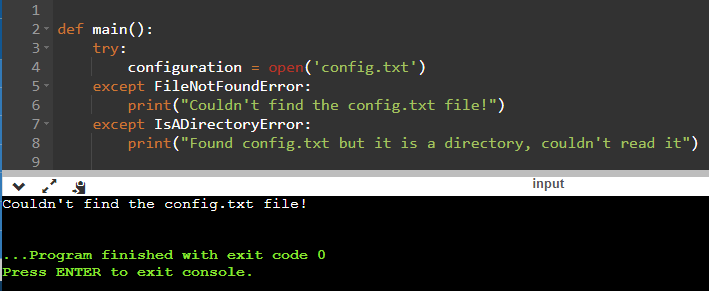
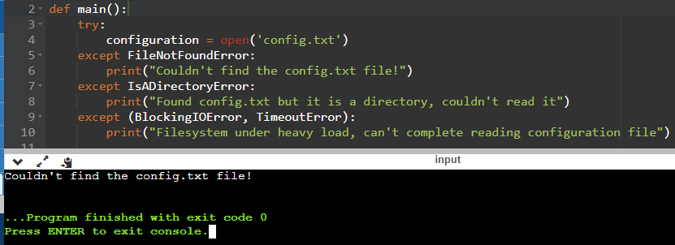
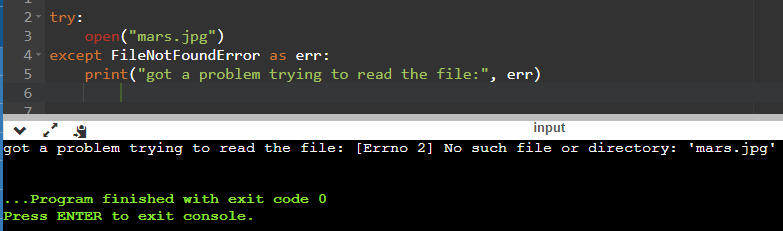
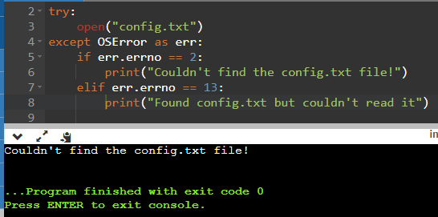
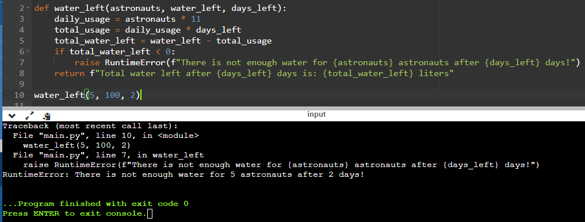
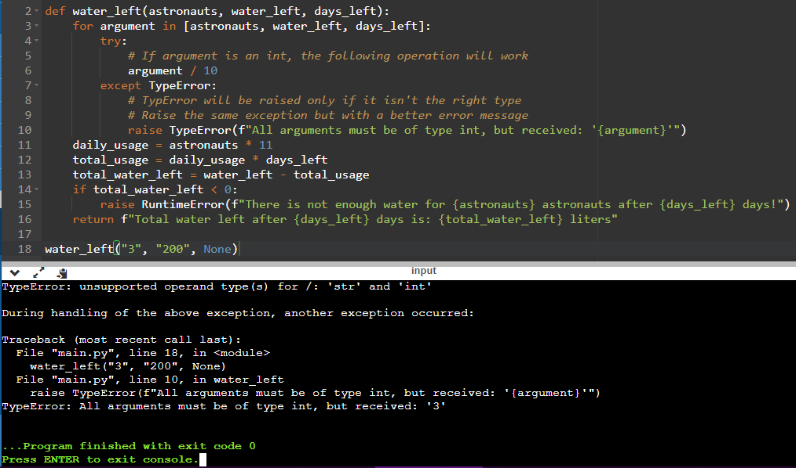

## Tracebacks

Intentando abrir un archivo inexistente.

## Función main()

Abrir el archivo en la terminal, con un error más legible.

## Try y Except (Catch)

Ejecutar código cuando ocurre un error, en este caso devolver un mensaje de error por no encontrar el archivo.

## Try y Except (Catch) con main()

Al abrir el archivo en la terminal, se muestra la excepción con mensaje genérico.

## Try y Except con varios errores

En este bloque de código se tienen varios except para diferentes errores que puedan ocurrir.

## Except con varios errores en uno mismo

En este bloque de código un except puede contener varios errores contenidos, para ejecutarse al entrar en cualquiera de ellos.

## Error como una variable, para visualizarlo en consola

El error que ocurre se almacena en una variable y se puede imprimir para visualizarla en consola.

## Diferencia con atributos el error

Los atributos del error, permiten diferenciar de manera más clara que es lo que está fallando.

## Crear excepciones propias RunTimeError

Crear excepciones propias, lanzando y ejecutando RunTimeError.

## Mejorando RunTimeError

Mejor legibilidad del error que se programó.

